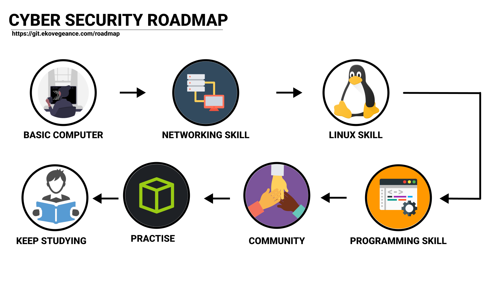

## CYBER SECUIRTY ROADMAP : Step by step Process

### CYBER SECUIRTY ROADMAP 2022
1. Keterampilan Komputer Dasar - Keterampilan komputer mengacu pada pengetahuan dan kemampuan yang diperlukan untuk mengoperasikan komputer dan teknologi terkait.
2. Keterampilan Jaringan Dasar - Keterampilan jaringan adalah salah satu bakat terpenting yang harus dimiliki jika Anda ingin menjadi peretas yang beretika.
3. Keterampilan Linux - Linux adalah pilihan paling populer untuk peretas karena fleksibilitasnya, platform sumber terbuka, portabilitas dan antarmuka baris perintah dan kompatibilitas dengan alat peretasan populer.
4. Keterampilan Pemrograman/Scripting - Keterampilan pemrograman sangat penting untuk menjadi peretas yang efektif. Salah satu alasan Anda ingin tahu cara membuat kode sebagai peretas adalah agar Anda dapat memodifikasi skrip yang akan Anda gunakan untuk meretas ke sistem yang berbeda
5. Aktif dalam Organisasi/Komunitas yang berkaitan dengan Cyber Secuirty -> [Bina Darma Cyber Army](https://discord.gg/tCVcsqFMJN)
6. Praktek - Berlatih dengan lab, seperti [TryHackME](https://tryhackme.com/), [HackTheBox](https://www.hackthebox.com/).
7. Terus belajar - Seiring berjalannya waktu kita harus bersemangat untuk mempelajari hal-hal baru

 
 
 
 
